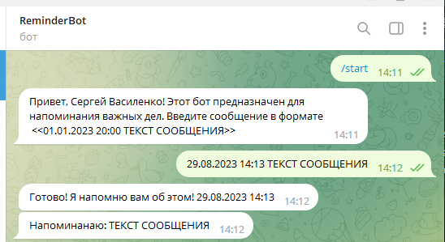

**_[Reminder Bot](t.me/Reminder_demo_bot)_**

(t.me/Reminder_demo_bot)

Данный бот создан для того чтобы напоминать пользователю о важных делах.
Пользователь обращается в месенджере Телеграм к данному боту через команду /start.
Далее, пользователю необходимо передать дату и сообщение в формате <<01.01.2023 20:00 ТЕКСТ СООБЩЕНИЯ>>.
Бот напомнит пользователю сообщением в указанное время.

This bot is designed to remind the user of important things.
The user accesses this bot in the Telegram messenger via the /start command.
Next, the bot needs to send the date and message in the format <<01.01.2023 20:00 MESSAGE TEXT>>.
The bot will remind the user with a message at the specified time.

Пример использования бота.
Bot example.

